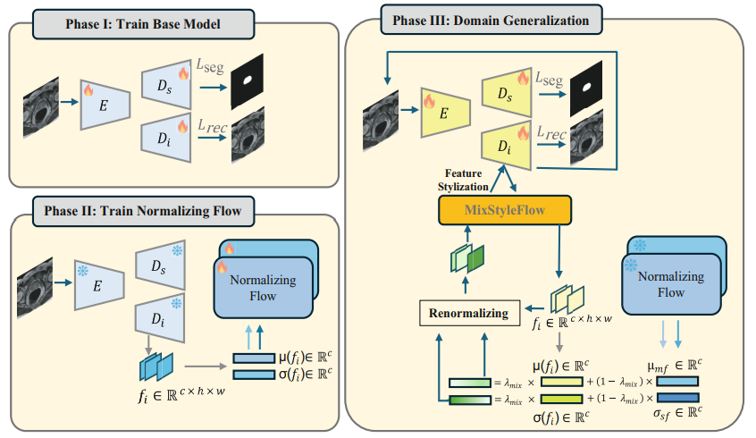

# MixStyleFlow: Domain Generalization in Medical Image Segmentation Using Normalizing Flows

This repository contains the official PyTorch implementation for our paper accepted at the International Conference on Medical Image Computing and Computer Assisted Intervention (MICCAI) 2025.

**[Paper Link](https://link.springer.com/chapter/10.1007/978-3-032-04947-6_36)**

  
   
  <em>The proposed MixStyleFlow framework.</em>

## Abstract
> **Abstract:** *Despite the success of deep learning in medical image segmentation, domain shifts caused by variations in scanners and imaging protocols often degrade performance, limiting real-world clinical deployment. Domain generalization (DG) aims to address this issue by learning robust models that generalize well across different domains. While existing DG methods based on feature space domain randomization have shown promise, they suffer from a limited and unordered search space of feature styles. In this work, we propose MixStyleFlow, a novel DG approach that utilizes normalizing flows to explicitly model the distribution of domain feature styles. By sampling domain feature styles from the learned normalizing flows and mixing them with original feature statistics along the feature channel dimension, our method effectively expands and diversifies domain
features in a controllable manner. We evaluate MixStyleFlow on two medical segmentation tasks—prostate MRI and fundus imaging—demonstrating superior generalization performance on unseen target-domain data. Our results highlight the potential of normalizing flows for improving domain generalization in medical image segmentation, paving the way for more robust deep learning models capable of handling diverse clinical scenarios.*
>
## Datasets

This work was trained and evaluated on the following publicly available datasets. Please refer to the original publications for details on licensing and usage.

* **[Prostate Segmentation](https://drive.google.com/file/d/1fMPqHETCvohh1e6D2rIlddWPLfHuyI8j/view?usp=sharing)**: Prostate MRI scans across seven different domains (Medical Decathlon, Sites A–F). Trained on Medical Decathlon, tested on six unseen domains..
* **[OD/OC Segmentation](https://zenodo.org/record/8009107)**: Fundus images from five different domains for optic disc/optic cup (OD/OC) segmentation.
